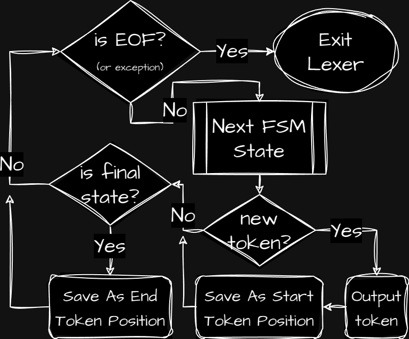

# Regex Tutorial

This is my own implementation of a regular expression engine in Kotlin.
It's based on lexical analysis and automata theory.

## Where I can find the explanation of the algorithm?

You can find the explanation of the algorithm in
[my blog](https://buttersus.github.io/PersonalWebsite/compilers-lexical-analysis.html).